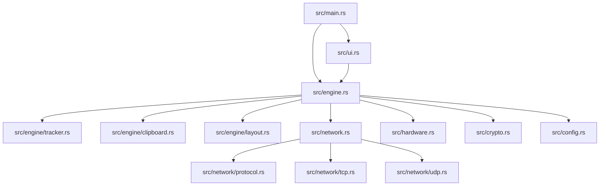
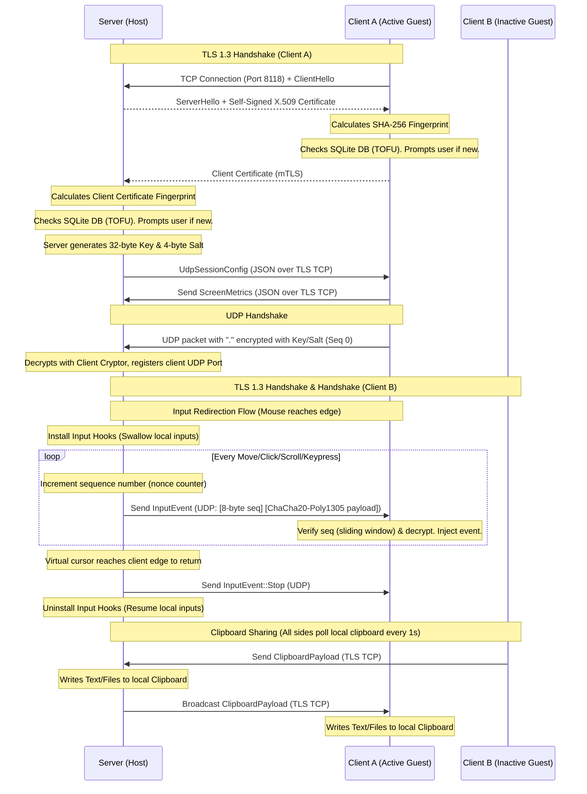

# flow Architecture & Developer Guide

Welcome to the **flow** developer guide! This document explains the system architecture, network flow, threading model, and implementation details to help you understand the inner workings of flow's codebase.

---

## 1. System Overview

`flow` is an open-source, cross-platform virtual KVM (Keyboard, Video, and Mouse) software. It runs in one of two modes:
1. **Server Mode (Host):** The computer with the physical mouse and keyboard. It tracks the mouse position, and if the cursor crosses a virtual boundary, it intercepts the inputs (swallowing them locally) and redirects them over the network.
2. **Client Mode (Guest):** The computer that receives input packets over the network and injects them directly into its native OS input event stream.

---

## 2. Codebase Architecture

The project is structured logically into separate systems:



* **[src/main.rs](src/main.rs):** Entry point. Initializes the SQLite DB cache, GTK (on Linux), and starts the `egui` native loop.
* **[src/engine.rs](src/engine.rs):** Entry point for the coordinator engine state. Delegates tracking and clipboard sync to dedicated sub-modules.
* **[src/engine/](src/engine/):** Engine sub-modules:
  * **[layout.rs](src/engine/layout.rs):** Renders coordinate translation/projection, clamping, and monitor boundary queries.
  * **[tracker.rs](src/engine/tracker.rs):** Performs low-latency edge tracking, KVM transitions, and hooks system mouse/keyboard events.
  * **[clipboard.rs](src/engine/clipboard.rs):** Manages local clipboard change notifications, reassembly chunks, and streaming payload promises.
* **[src/network.rs](src/network.rs):** Networking module stack: Exposes network submodules, provides local IP utilities, and initializes the global asynchronous `TOKIO_RUNTIME`.
  * **[tcp.rs](src/network/tcp.rs):** Manages connection handshakes, screen metrics exchange, and clipboard synchronization.
  * **[udp.rs](src/network/udp.rs):** Runs the low-latency network pipeline for high-frequency input events.
  * **[protocol.rs](src/network/protocol.rs):** Defines network serialization structs (`InputEvent`, `ClipboardPayload`, `ScreenMetrics`).
  * **[tls.rs](src/network/tls.rs):** Custom Trust-On-First-Use (TOFU) mutual TLS verifiers (`TofuServerVerifier` and `TofuClientVerifier`) and PEM loading helpers.
* **[src/hardware.rs](src/hardware.rs):** Hardware input capture and simulation stack: Manages conditional compilation (`#[cfg(target_os)]`) to dynamically select and export the correct OS-specific FFI backend at build time.
  * **Platform Backends:** Platform-specific FFI modules (`mac.rs`, `win.rs`, `linux.rs`) implementing OS-specific hooks and input injection.
* **[src/crypto.rs](src/crypto.rs):** Handles self-signed X.509 certificate generation/loading, SHA-256 fingerprint computation, sliding window replay protection for UDP packets, and symmetric ChaCha20-Poly1305 encryption/decryption.
* **[src/config.rs](src/config.rs):** SQLite database layer (`rusqlite`) for saving settings and global monitor layouts.
* **[src/ui.rs](src/ui.rs):** Immediate-mode UI layout coordinator: Coordinates the desktop configurations view, polls background status variables, manages tray menu interactions, and executes async engine reloads when settings are saved.
  * **[src/ui/canvas.rs](src/ui/canvas.rs):** Renders the interactive layout map panel where users drag, drop, and snap virtual monitor borders in the coordinated workspace.
  * **[src/ui/tray.rs](src/ui/tray.rs):** Hooks native platform system tray icons, managing connection status visuals (Checkmark vs. Error indicators).

---

## 3. Network & Control Timeline

The following sequence diagram outlines a typical timeline where **Client A** starts active, **Client B** connects in the background, control returns to the server, and a clipboard event is broadcasted:



## 4. Communication Protocol

`flow` encrypts all control traffic using **TLS 1.3** and real-time input events using **ChaCha20-Poly1305 AEAD**. Trust is validated using a **Trust on First Use (TOFU)** model checking self-signed certificate fingerprints against a SQLite database store (see [src/crypto.rs](file:///Users/guyavraham/flow/src/crypto.rs)).

### 4.1 TCP Control Channel (Port 8118)

TCP is used for connection establishment, capability exchange, and clipboard synchronization, entirely wrapped in TLS 1.3.

#### TCP Frame Format (Message Framing)
To demarcate JSON payloads sent over the stream, each message is transmitted with a length prefix:
* **Length Header**: 10-byte ASCII, zero-padded integer representing the length of the plaintext payload (e.g., `0000000084`).
* **Plaintext Payload**: The raw JSON payload (e.g. `UdpSessionConfig`, `ScreenMetrics`, or `ClipboardPayload`).

#### Connection & Handshake Flow
1. **TLS Handshake & mTLS TOFU**:
   * The client connects to port `8118` and starts the TLS 1.3 handshake.
   * Both sides exchange self-signed certificates and calculate their SHA-256 fingerprints.
   * If a fingerprint is not found in the local SQLite table `known_hosts`, the handshake thread blocks, and a modal displays in the `egui` GUI requesting user confirmation. If accepted, the fingerprint is saved to the DB.
2. **UDP Session Key Configuration**:
   * Immediately after TLS is established, the Server generates a random 32-byte key and 4-byte salt, serializing them into a `UdpSessionConfig` message sent to the client.
3. **Screen Metrics Exchange**:
   - The client responds by sending its multi-monitor configuration and DPI scaling properties serialized as JSON in `ScreenMetrics` format.
4. **Control & Clipboard Channel**:
    - Eager Syncing: For payloads <= 5MB, a `ClipboardPayload::Text` or `ClipboardPayload::Files` is serialized to JSON and transmitted immediately over the TLS stream.
    - Lazy Syncing (Promises): For payloads > 5MB, the source client/server registers the content locally and broadcasts a `ClipboardPayload::Offer` containing a unique ID, total size, and format.
    - When the user triggers a paste on the destination client, the OS pasteboard requests the promised data. The destination client sends a `ClipboardPayload::Request` back to the source.
    - The source client then streams the payload over TLS in sequential `ClipboardPayload::Chunk` blocks of 64KB, which are accumulated in memory on the destination client and written to the pasteboard upon completion. Intermediate forwarding nodes do not accumulate these chunks to save memory and avoid UI progress indicators.
    - Loopback Prevention: To prevent infinite clipboard sync feedback loops, all network-received updates are hashed and ignored when the local OS clipboard listener detects the change. Both eager writes (text/files) and lazy promise completions (fulfilled on-demand via native FFI) are registered in the hardware module's unified global `CLIPBOARD_IGNORE_HASHES` queue. Additionally, a global `IN_SET_CLIPBOARD` guard is set during eager sync updates to temporarily pause the clipboard change listener and eliminate race conditions.
5. **Connection Persistence & Reconnection Loop**:
   - The client runs a background connection loop (using cooperative 200ms checks) that automatically retries the TCP/TLS connection every 2 seconds if disconnected.
   - To prevent clean-up race conditions when a client disconnects and quickly reconnects, the server generates a unique ephemeral random `connection_id` (`u64`) for each session. During cleanup, the server checks this ID to ensure it only terminates the exact defunct connection instance, and uses pointer comparison (`Arc::ptr_eq`) to preserve active sessions.

### 4.2 UDP Input Channel (Port 8118)

UDP is used for low-latency transmission of high-frequency input events.

#### UDP Handshake
To bind client/server UDP sockets:
* The client sends a UDP packet containing a handshake signature: the character `.` encrypted with `UdpCryptor` at sequence number `0`.
* The server decrypts and verifies the packet using the client's cryptor to register the client's public UDP socket endpoint (`SocketAddr`).

#### Input Event Payload Format
All input events are sent as secure UDP packets:
* **Sequence Header**: 8-byte big-endian unsigned 64-bit integer (`u64`). Used directly to construct the 12-byte cryptographic nonce: `[4-byte salt] [8-byte sequence]`.
* **Ciphertext**: ChaCha20-Poly1305 encrypted space-delimited text event payload.
* **Anti-Replay**: The receiver validates incoming sequence numbers using a **64-packet sliding window bitmask** to discard duplicate or delayed packets.

Once decrypted, the payload follows a space-delimited text protocol:

| Format / Event | Description | Example |
|---|---|---|
| `mov <x> <y>` | Warps mouse to coordinates `x`, `y` | `mov 1280 720` |
| `scrl <dx> <dy>` | Simulates mouse scroll wheel offsets | `scrl 0 -120` |
| `prsm <pressed> <button>` | Simulates mouse click event (`pressed` is `true`/`false`, `button` is e.g. `Left`, `Right`) | `prsm true Left` |
| `prsk <pressed> <key>` | Simulates key press/release (`pressed` is `true`/`false`, `key` is key string identifier) | `prsk false Shift` |
| `stp` | Directs the client to stop capturing inputs and returns focus to the server | `stp` |

---

## 5. Threading & Concurrency Model

`flow` leverages native OS multi-threading for zero-latency execution. Below is a detailed breakdown of all active threads running in both Server and Client modes:

### Server Mode Threads (Host)

| Thread | Spawned by | Purpose / Role | Lifespan |
|---|---|---|---|
| **Main Thread (UI)** | System | Runs the `egui` / `winit` UI rendering loop (`eframe::run_native`). Handles user interactions, updates visual elements, and renders layout canvases. | Application lifetime |
| **TCP Accept Task** | tcp.rs | Runs an asynchronous loop on the global `TOKIO_RUNTIME` waiting to accept incoming client connections. | Active while Server is running |
| **Client Connection Task (1 per client)** | tcp.rs | Runs an asynchronous task on the global `TOKIO_RUNTIME` listening for incoming TCP/TLS payloads (handshake validation, screen metrics, and clipboard payloads) from a specific client. | Lifetime of client connection |
| **UDP Handshake Thread (1 per client)** | engine.rs | Created temporarily to wait for the client's UDP handshake packet to extract and store their remote UDP port, then terminates. | Transient (less than 3 seconds) |
| **Edge Tracking Thread** | tracker.rs | Runs a 10ms loop checking local mouse boundaries. When control shifts, it activates blocking system-level input hooks (listening for mouse/keyboard inputs) and packages them to UDP. | Active while Server is running |
| **Clipboard Listener Thread** | clipboard.rs | Detects local pasteboard updates natively (e.g. 250ms `changeCount` polling on macOS, window message loops or signals on Windows/Linux) and notifies the sync manager. | Active while Server is running |
| **Engine Reload Thread** | ui.rs | Spawned briefly when the user hits "Save" to stop the engine and re-initialize socket bindings without freezing the UI thread. | Transient |

### Client Mode Threads & Tasks (Guest)

| Thread / Task | Spawned by | Purpose / Role | Lifespan |
|---|---|---|---|
| **Main Thread (UI)** | System | Runs the `egui` interface and tray indicators. | Application lifetime |
| **TCP Client Task** | tcp.rs | Runs an asynchronous loop on the global `TOKIO_RUNTIME` to receive incoming server clipboard packets once connected. | Active while Client is running |
| **UDP Client Thread** | udp.rs | Listens on a UDP socket for real-time input events (`Move`, `KeyPress`, `Stop`), decrypts them, and immediately simulates them on the local OS. | Active while Client is connected |
| **Clipboard Listener Thread** | clipboard.rs | Detects local pasteboard updates natively and notifies the sync manager. | Active while Client is running |

### Thread Communication & Shared Data

State variables are synchronized across thread boundaries using lock-protected reference counters (`Arc<Mutex<T>>`):

| Shared Variable | Type | Written By | Read By | Purpose |
|---|---|---|---|---|
| **`settings`** | `Arc<Mutex<SettingsData>>` | Main UI Thread | Edge Tracker, TCP/UDP threads | Stores mode (Server/Client), Server IP, and encryption password. |
| **`is_running`** | `Arc<Mutex<bool>>` | Main UI Thread | All background threads | Controls engine startup, teardown, and reloading loops. |
| **`global_mouse_x`** | `Arc<Mutex<i32>>` | Edge Tracker, Mouse Hook | Edge Tracker | Tracks the virtual mouse X coordinate in the global coordinated desktop space. |
| **`global_mouse_y`** | `Arc<Mutex<i32>>` | Edge Tracker, Mouse Hook | Edge Tracker | Tracks the virtual mouse Y coordinate in the global coordinated desktop space. |
| **`active_clients`** | `Arc<Mutex<HashMap<...>>>` | TCP connection threads | Edge Tracker | Tracks connected client monitors configuration, DPI scaling parameters, and UDP endpoints. |
| **`current_controlled`** | `Arc<Mutex<String>>` | Edge Tracker | OS Input Hooks | Tracks which screen holds input focus (`"main"` or client IP). |
| **`is_connected`** | `Arc<Mutex<bool>>` | TCP threads | Main UI Thread | Drives visual tray connection status indicators ($V$ / $X$). |
| **`udp_server`** | `Arc<Mutex<Option<UdpServer>>>` | Main UI Thread | Edge Tracker | Stores the server's UDP socket reference to send input event packets. |
| **`CLIPBOARD_IGNORE_HASHES`** | `Lazy<Mutex<Vec<u64>>>` | TCP connection threads & FFI promise threads | Clipboard listener (`on_change` in engine.rs) | Stores hashes of recent network-received clipboard contents (both eager and lazy updates) to prevent network loopbacks. |
| **`IN_SET_CLIPBOARD`** | `AtomicBool` | TCP connection threads | Clipboard listener | Guard variable set during eager sync updates to temporarily pause the clipboard change listener and prevent race condition loopbacks. |
| **`offered_data`** | `Arc<Mutex<Option<OfferedData>>>` | Clipboard Monitor / TCP connection threads | TCP connection threads | Stores locally owned large clipboard offers waiting to be requested by remote peers. |

---

## 6. OS-Specific FFI & Hardware Integration

`flow` uses the `src/hardware` module as a Hardware Abstraction Layer (HAL) to standardize cross-platform hardware events and OS windowing hooks (e.g., Win32, Cocoa/Quartz, X11). The HAL is defined using four key traits in [src/hardware.rs](file:///Users/guyavraham/flow/src/hardware.rs):

*   **`MouseSimulator`**: Standardizes mouse cursor warping, scrolling, and button clicks.
*   **`KeyboardSimulator`**: Standardizes keystroke injection.
*   **`InputHookListener`**: Handles low-level OS hooks to intercept and swallow/suppress mouse and keyboard inputs when KVM redirection is active.
*   **`ClipboardManager`**: Manages clipboard reading/writing, loopback hashes, and lazy promise-rendering callbacks.

Low-level OS FFI imports, Carbon/Quartz wrappers, and synchronous platform-specific FFI callbacks (e.g., Cocoa `NSPasteboard` owners) are isolated into native driver submodules (such as [src/hardware/mac/sys.rs](file:///Users/guyavraham/flow/src/hardware/mac/sys.rs)).

#### 1. Screen & Keyboard Initialization Functions
* **`pub fn get_screeninfo() -> (i32, i32)`**
  * Returns the primary screen width and height in pixels.
* **`pub fn get_monitors() -> Vec<MonitorInfo>`**
  * Returns the active display geometries (DPI scale factors, bounds, and names) for the host machine.
* **`pub fn init_keyboard_layout()`**
  * Invoked on the main thread during app startup to cache keyboard layouts if required by the target OS.

#### 2. ClipboardController Struct
Manages reading from and writing to the OS clipboard.
```rust
pub struct ClipboardController;

impl ClipboardController {
    // Queries current clipboard contents and returns it as a string
    pub fn data() -> String;

    // Sets the clipboard text content
    pub fn set_text(text: &str);

    // Sets the clipboard copied files content using absolute file paths
    pub fn set_files(paths: Vec<String>);
}
```

#### 3. Promised Clipboard Struct
Manages delayed rendering and streaming transfer of large clipboard payloads over the network.
```rust
pub struct PromisedClipboard;

impl PromisedClipboard {
    // Registers a lazy promise owner for delayed rendering of large payloads
    pub fn set_promise(id: &str, format: &str, size: usize);

    // Feeds an incoming network chunk of streaming payload to the active promise
    pub fn write_chunk(id: &str, chunk: Vec<u8>, is_last: bool);

    // Registers a clean callback closure for FFI-to-engine request notification
    pub fn on_request<F>(callback: F) where F: Fn(String) + Send + Sync + 'static;
}
```

#### 4. Clipboard Listener Struct
Platform-native listener abstraction to detect local clipboard updates without polling in cross-platform engine code.
```rust
pub struct ClipboardListener;

impl ClipboardListener {
    // Instantiates a new listener with a change handler callback
    pub fn new<F>(on_change: F) -> Self
    where
        F: Fn() + Send + Sync + 'static;

    // Starts listening for clipboard change events
    pub fn start(&self);

    // Stops listening and joins any background worker threads
    pub fn stop(&self);
}
```

#### 3. Keyboard Controller (Client simulation)
Simulates keyboard events.
```rust
pub struct KeyboardController;

impl KeyboardController {
    pub fn new() -> Self;

    // Simulates key press down
    pub fn press(&self, key: &str);

    // Simulates key release up
    pub fn release(&self, key: &str);
}
```

#### 4. Keyboard Listener (Server interception)
Hooks keyboard events and swallows/suppresses local input when KVM redirection is active.
```rust
pub struct KeyboardListener;

impl KeyboardListener {
    // Constructor. callback parameters should accept key strings and press status.
    // if suppress is true, captured keys must be swallowed at the OS level.
    pub fn new<FPress, FRelease>(on_press: FPress, on_release: FRelease, suppress: bool) -> Self
    where
        FPress: Fn(String) + Send + Sync + 'static,
        FRelease: Fn(String) + Send + Sync + 'static;

    // Starts the event listening loop
    pub fn start(&self);
}
```

#### 5. Mouse Controller (Client simulation)
Simulates mouse coordinates, clicks, and scroll wheel actions.
```rust
pub struct MouseController;

impl MouseController {
    pub fn new() -> Self;

    // Returns current local cursor (x, y) coordinates
    pub fn position(&self) -> (i32, i32);

    // Warps mouse cursor directly to coordinates (x, y)
    pub fn set_position(&self, pos: (i32, i32));

    // Simulates mouse button click (press down)
    pub fn press(&self, button: &str);

    // Simulates mouse button release (up)
    pub fn release(&self, button: &str);

    // Simulates scroll wheel movement
    pub fn scroll(&self, dx: i32, dy: i32);
}
```

#### 6. Mouse Listener (Server interception)
Hooks mouse inputs and swallows local movements when redirection is active.
```rust
pub struct MouseListener;

impl MouseListener {
    // Constructor. If suppress is true, captured events must be swallowed.
    pub fn new<FMove, FClick, FScroll>(on_move: FMove, on_click: FClick, on_scroll: FScroll, suppress: bool) -> Self
    where
        FMove: Fn(i32, i32) + Send + Sync + 'static,
        FClick: Fn(i32, i32, String, bool) + Send + Sync + 'static,
        FScroll: Fn(i32, i32, i32, i32) + Send + Sync + 'static;

    // Starts the mouse tracking loop
    pub fn start(&self);
}
```

### Adding a New OS Backend

To support a new operating system or windowing system, implement a new backend driver module using these steps:

1. Create the source file under the hardware directory: `src/hardware/<your_os>.rs`.
2. Implement the HAL traits (`MouseSimulator`, `KeyboardSimulator`, `InputHookListener`, and `ClipboardManager`) inside your new file.
3. Expose the concrete driver implementations (`ClipboardController`, `KeyboardController`, `KeyboardListener`, `MouseController`, `MouseListener`, `ClipboardListener`, and screen metrics helpers) that implement these traits.
4. Implement `pub(crate) fn set_promise_impl(id: &str, format: &str, size: usize)` within your new file to handle registering the platform-specific lazy promise owner.
5. Expose the new module in `src/hardware.rs` using conditional compilation attributes:

```rust
#[cfg(target_os = "<your_os>")]
pub mod <your_os>;

#[cfg(target_os = "<your_os>")]
pub use <your_os>::{
    ClipboardController, KeyboardController, KeyboardListener, MouseController, MouseListener, get_screeninfo,
    init_keyboard_layout, ClipboardListener,
};