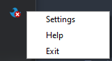

# flow


flow is a cross-platform virtual KVM software which allows control of multiple computers with multiple operating systems with one mouse and keyboard.

flow sends data through the local network, fast and securly, for you to have an effortless and cohesive experience. Simply move your mouse from one computer to another, flow will do all the work...

<br>

| Features | |
|-----------|-|
| Mouse and Keyboard Sharing | ✔️ |
| Clipboard Sharing | ✔️ |
| File Transfer | ✔️ |
| Unlimited Devices | ✔️ |
| Cross-platform | ✔️ |
| Set and Forget | ✔️ |
| AES Network Encryption | ✔️ |
| Zero Latency | ✔️ |
| Open-source | ✔️ |

<br>

## Installation

#### Source Code:
1. Download [python](https://www.python.org/downloads/release/python-395/). (>3.8)

2. `$ git clone https://github.com/guyavrhm/flow`

3. `$ pip install -r requirements.txt`
  
4. `$ make`

#### Binary Release:

*   #### Windows:
    1. Download the [installer](https://github.com/guyavrhm/flow/releases/download/v1.0.4/flow.v1.0.4.setup.exe).
    2. Run the installer to install flow on your machine.
    3. A shortcut to flow will appear on your desktop.

*   #### Mac:
    1. Download the [.dmg](https://github.com/guyavrhm/flow/releases/download/v1.0.3/flow-1.0.3.dmg) file.
    2. Click on the downloaded file and drag the flow app to the applications folder.
    3. flow will be in your applications.

*   #### Linux:
    1. Download the [tar.gz](https://github.com/guyavrhm/flow/releases/download/v1.0.3/flow-1.0.3.tar.gz) file.
    2. `$ tar -xzf flow-1.0.3.tar.gz`
    3. `$ ./setup.sh`
    4. flow will be in your applications.


## Usage
1.
    #### Source Code:
    * `$ python flow.py`

    #### Binary Release:
    * Click on the flow application.

2. Simply move your mouse from one screen to the other, exactly like when having a second monitor.

#### Configuration

* While flow is running in the background, a tray icon will show.
<br>

*  indicates that there is no connection.

*  indicates that there is a connection.

* Right click on the icon to open the menu.
<br><br>


## Contact
If you want to contact me you can reach me at my [email](mailto:guy.ava03@gmail.com).

## Other
Supported OSes:
* Windows
* MAC
* Linux (xorg)


Linux file renamed in python 3.9 fix:
```
cd /usr/lib/x86_64-linux-gnu/
ln -s -f libc.a liblibc.a
```

## License

Copyright (c) Guy Avraham. All rights reserved.

Licensed under the [MIT](LICENSE) license.
