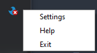

# 


flow is a cross-platform virtual KVM software which allows control of multiple computers running different operating systems with one mouse and keyboard.


Built in Rust, flow is designed to be highly efficient, secure, and modular (see [`ARCHITECTURE.md`](ARCHITECTURE.md)).

<br>

## Features

* Mouse and keyboard sharing
* Clipboard sharing
* File transfer
* Network encryption
* Set and forget
* Cross-platform
* Unlimited devices
* Zero latency
* Open-source

<br>

## Installation

> [!IMPORTANT]
> Install flow on all computers in your setup.

#### Direct Download (Recommended):

1. Go to the [flow Releases Page](https://github.com/guyavrhm/flow/releases/latest).
2. Download the installer matching your operating system:
   * **Windows:** Download the `flow-windows-v*.setup.exe` installer and run it.
   * **Mac (Apple Silicon):** Download the `flow-macos-arm64-v*.dmg` file and drag flow to your Applications folder.
   * **Mac (Intel):** Download the `flow-macos-intel-v*.dmg` file and drag flow to your Applications folder.
   * **Linux:** Download the `flow-linux-v*.tar.gz` archive, extract it (`tar -xzf flow-linux-v*.tar.gz`), and run `./setup.sh`.

#### Build from Source:

Run the following commands in your terminal:
```bash
git clone https://github.com/guyavrhm/flow && cd flow
make build
make run
```


## Usage

Simply move your mouse from one screen to the other, exactly like when having a second monitor.

#### Configuration

* While flow is running in the background, a tray icon will show.
<br>

*  indicates that there is no connection.

*  indicates that there is a connection.

* Right click on the icon to open the menu.
<br><br>


## Supported OSes

| OS | Supported Versions / Architectures |
| :--- | :--- |
| **Windows** | 10, 11 |
| **macOS** | Apple Silicon, Intel |
| **Linux** | X11 |

## Contact
If you want to contact me you can reach me at my [email](mailto:guy.ava03@gmail.com).

## License

Copyright (c) Guy Avraham. All rights reserved.

Licensed under the [MIT](LICENSE) license.
